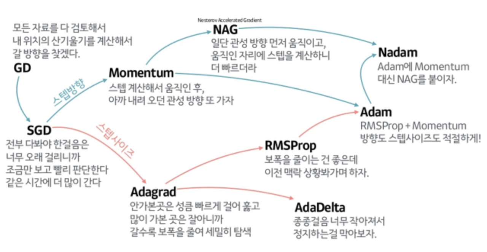

## Chapter 6. 학습 관련 기술들

| File | Description | Page |
| :-- | :-- | :-- |
| multi_layer_net.py | Basic multi-layered NN | 225 |
| hyperparameter_optimization.py | Example of optimizing hyperparameter |  |

### Concept
- Optimizer : 매개변수 갱신
  - SGD : Stochastic Gradient Descent
  - Momentum : 관성 구현
  - AdaGrad : Learning rate decay
  - Adam : Momentum + Adam
- 가중치의 초깃값
  - 가중치가 너무 작게 분포되어 있으면 (치우쳐져 있으면) 표현력을 제한하는 문제가 발생한다. 
  - 전부 0으로 둬도 안 된다.
  - 가중치가 너무 크게 분포되어 있으면 gradient vanishing 문제가 발생한다.
  - Xavier initialization (Xavier 초깃값) : 앞 계층의 노드가 n개일 때, 표준편차가 $\frac{1}{\sqrt{n}}$인 분포. 주로 시그모이드 함수 모양의 S자 곡선 활성화 함수를 다루는 노드에 적용된다. (sigmoid보단 tanh에 더 잘 적용된다.)
  - He initialization : 표준편차가 $\sqrt{\frac{2}{n}}$인 분포. 주로 ReLU 노드에 사용된다.
- Batch normalization : 미니배치의 분포가 평균이 0, 분산이 1이 되도록 정규화
  - (intput) : (Affine)-(Batch Norm.)-(ReLU)-... : (output)과 같은 순서로 사용된다.
- 오버피팅을 막는 방법
  - Weight decay(가중치 감소) : 가중치가 큰 노드에 큰 학습을 강요
    - L1 법칙 : 가중치 원소의 절댓값의 합
    - L2 법칙 : 각 원소의 제곱(의 제곱근 혹은 *0.5)
    - L$\infty$ 법칙 : 각 원소 중 최댓값
  - Dropout : 노드를 무작위로 선택해 삭제
  - Ensemble learning : 개별적으로 학습시킨 여러 모델의 출력을 비교해 추론
    - Voting
    - Average
    - Bagging : 훈련되는 데이터셋도 나눔
- 적절한 Hyperparameter 값 찾기
  - Validation data : Hyperparameter의 성능을 평가할 때는, train data, test data와는 별개의 data를 사용해야 한다.
  - Hyperparameter 최적화
    1. Hyperparameter의 값의 범위 설정 (로그 스케일 범위가 좋음)
    2. 설정된 범위에서 값을 무작위로 추출
    3. Validation data로 정확도 평가 (Epoch은 작게 설정하는 것이 좋다.)
    4. 이를 반복하며 정확도를 보고 범위를 좁혀 나간다.

